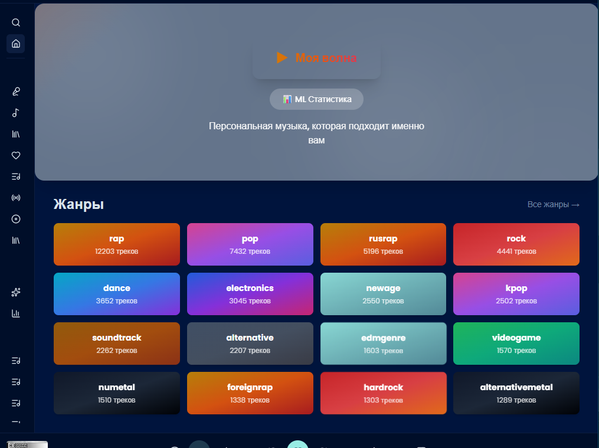
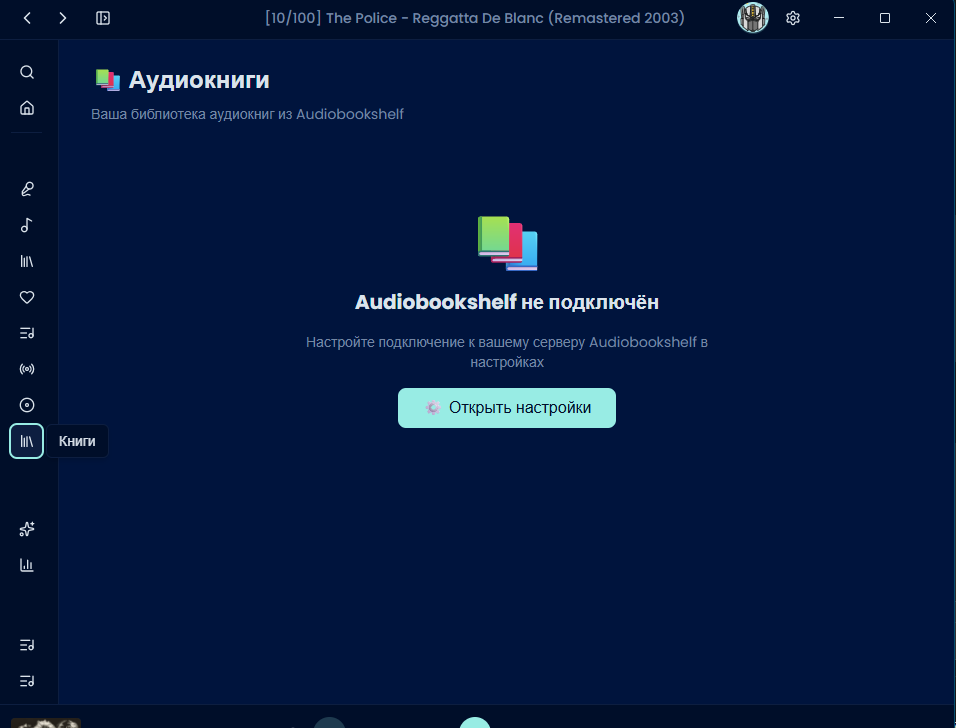

# 🎵 KumaFlow 

**Современный музыкальный плеер для Navidrome/Subsonic с ML-рекомендациями, Vibe Similarity и полной кастомизацией**

[](https://github.com/mrSaT13/kumaflow/releases/latest)
[](LICENSE.txt)
[](https://github.com/mrSaT13/kumaflow/releases)
[](https://github.com/mrSaT13/kumaflow/releases)

---

## 📖 О проекте

**KumaFlow** — это глубоко переработанный форк [Aonsoku](https://github.com/victoralvesf/aonsoku)  с  **полностью переработанными ML-рекомендациями**, уникальной системой **Vibe Similarity** и **расширенной интеграцией Audiobookshelf**.

> 💡 **Философия KumaFlow**: Не просто плеер, а умный музыкальный компаньон, который понимает ваши предпочтения и создаёт плейлисты.

---

## KumaFlow что  внутри

##  Главное окно (Home Page)
#### 🔹 Hero-секция "Моя волна"
**Особенности:**
- Анимированный градиентный фон
- Динамически меняется от предпочтений
- Быстрый запуск персонального плейлиста

#### 🔹 Секция жанров (цветные карточки)

**Особенности:**
- Уникальные градиенты для каждого жанра
- Количество треков в жанре
- Быстрый запуск радио жанра
- 16 самых популярных жанров

#### 🔹 Настраиваемые секции

**Особенности:**
- Включение/выключение секций
- Изменение порядка перетаскиванием
- Сохранение настроек

---
#### 🔹 Библиотека книг
**Особенности:**
- Прогресс чтения на карточке
- Фильтры: "Все", "Читаю", "Прочитано"
- Индикатор воспроизведения
- Быстрый запуск

#### 🔹 Страница книги
**Особенности:**
- Детальная информация о книге
- Визуальный прогресс с полоской
- Кнопка "Продолжить" с процентом
- Кнопка "С последней главы"
- Список всех глав с длительностью
- Описание книги

---

##  ML Статистика
#### 🔹 Дашборд статистики
 
**Особенности:**
- Общая статистика
- Распределение по жанрам
- Активность прослушиваний
- Точность рекомендаций

---
 


| **ML рекомендации** | ✅ Продвинутые |

| **Vibe Similarity** | ✅ Уникальная система |

| **Smart Auto-DJ**   | ✅ 2.0 с оркестратором |

| **Аудиоанализ**     | ✅ BPM, энергия, танцевальность |

| **Темы оформления** | ✅ 50+ |

| **Кастомизация**    | ✅ Полная |

| **Audiobookshelf**  | ✅ готовая интеграция |

| **Ban-лист**        | ✅ Есть |

| **Подписки на артистов** | ✅ Есть |

| **Горячие клавиши** | ✅ Расширенные |

| **Discord RPC**     | ✅ Есть |

---

## ✨ НОВЫЕ функции KumaFlow 

### 🤖 1. Умные ML Рекомендации

#### 🔹 Vibe Similarity (Уникальная система)
**Анализ аудио-признаков:**
- **BPM** — темп трека
- **Energy** — уровень энергии  
- **Danceability** — танцевальность  
- **Valence** — позитивность/настроение  
- **Acousticness** — акустичность  
- **Instrumentalness** — наличие вокала 

**Как работает:**
```
1. Анализирует последние 5 прослушанных треков
2. Вычисляет средний "вайб" (energy wave)
3. Ищет треки с похожими признаками
4. Фильтрует по banned artists
5. Оркестрирует для плавных переходов
```

#### 🔹 Smart Auto-DJ 2.0
**Отличия от стандартного Auto-DJ:**
- ✅ **Контекстный анализ** — учитывает время суток
- ✅ **Vibe фильтрация** — выбирает по аудио-признакам
- ✅ **Оркестратор** — сортирует для плавных переходов
- ✅ **Ban-лист** — исключает заблокированных артистов
- ✅ **История** — не повторяет недавние треки

#### 🔹 Оркестратор плейлистов
**Сортировка треков по:**
- **Energy sorting** — от энергичных к спокойным
- **BPM matching** — похожий темп рядом
- **Harmonic mixing** — совместимые музыкальные ключи
- **Mood grouping** — группировка по настроению

**Пример:**
```
Плейлист "Вечерний отдых":
1. Трек 1: Energy 0.8, BPM 128
2. Трек 2: Energy 0.7, BPM 125 ← плавный переход
3. Трек 3: Energy 0.6, BPM 120 ← плавный переход
4. Трек 4: Energy 0.5, BPM 115 ← расслабление
```

#### 🔹 Ban-лист артистов
**Полная блокировка:**
- ✅ Не играет в радио
- ✅ Не попадает в рекомендации
- ✅ Не используется в Auto-DJ
- ✅ Не показывается в похожих треках

---

### 🎨 2. Интерфейс и кастомизация

#### 🔹 50+ тем оформления
- **Dark темы:** 20 вариантов
- **Light темы:** 15 вариантов
- **Цветные темы:** 15 вариантов
- **Сезонные темы:** 5 вариантов

#### 🔹 Кастомизация прогресс-бара
**Настройки:**
- **Тип:** линия, полоса, круг
- **Цвет:** любой из палитры
- **Форма:** закруглённый, острый
- **Размер:** тонкий, средний, толстый
- **Анимация:** плавная, мгновенная

#### 🔹 Адаптивный дизайн
**Оптимизация для:**
- ✅ 4K мониторов
- ✅ Ultrawide (21:9)
- ✅ Ноутбуков (1366x768)

---

### 📚 3. Audiobookshelf Интеграция

**Полная поддержка аудиокниг:**

#### 🔹 Библиотека книг
- ✅ Отображение всех книг из Audiobookshelf
- ✅ Фильтры: "Все", "Читаю", "Прочитано"
- ✅ Прогресс чтения с синхронизацией/на тес
- ✅ Обложки книг с сервера

#### 🔹 Воспроизведение
- ✅ **Все главы в плейлисте** — автоматическое добавление
- ✅ **Запуск с последней главы** — продолжение чтения
- ✅ **Прогресс** — автосохранение каждые 30 секунд
- ✅ **Визуальный прогресс** — полоска, процент, время

#### 🔹 Страница книги
- ✅ **Детали:** автор, описание, серия, жанры
- ✅ **Список глав** — переключение между главами
- ✅ **Кнопка "С последней главы"** — быстрое продолжение
- ✅ **Прогресс чтения** — наглядное отображение

#### 🔹 ML не учитывает книги
- ✅ Аудиокниги исключены из рекомендаций
- ✅ Не влияют на Vibe Similarity
- ✅ Не попадают в Auto-DJ

---

### 🌐 4. Расширенные интеграции

#### 🔹 Last.fm
 
- ✅ **Scrobbling** — отправка прослушиваний
- ✅ **Top charts** — мировые чарты
- ✅ **Similar tracks** — похожие треки
- ✅ **Artist info** — информация об исполнителях
- ✅ **Import library** — импорт любимых треков

#### 🔹 Fanart.tv
- ✅ **Логотипы артистов** — для интерфейса
- ✅ **Баннеры** — для фона
- ✅ **Обложки альбомов** — альтернативные
- ✅ **HD изображения** — высокое качество

#### 🔹 Wikipedia
 
- ✅ **Биографии артистов** — на странице исполнителя
- ✅ **История группы** — подробная информация
- ✅ **Дискография** — список альбомов
- ✅ **Участники** — состав группы

#### 🔹 Apple Music & Discogs
 
- ✅ **Обложки артистов** — с Apple Music
- ✅ **Дискография** — с Discogs
- ✅ **Рейтинги** — оценки альбомов
- ✅ **Жанры** — подробная классификация

---

### 🎵 5. Музыкальные функции

#### 🔹 Activity Mix (10 миксов)
**Предустановленные плейлисты:**
1. 🏃 **Running** — энергичная музыка для бега
2. 🚴 **Cycling** — ритмичная для велосипеда
3. 🏋️ **Workout** — мощная для тренировок
4. 🧘 **Yoga** — спокойная для йоги
5. 💼 **Work** — фокус для работы
6. 📚 **Study** — концентрация для учёбы
7. 🎉 **Party** — весёлая для вечеринок
8. 🚗 **Driving** — для поездки в машине
9. 🌅 **Morning** — утренняя музыка
10. 🌙 **Night** — вечерняя музыка

#### 🔹 Mood Mix (9 миксов)
**По настроению:**
1. 😊 **Happy** — радостная
2. 😢 **Sad** — грустная
3. 😌 **Calm** — спокойная
4. 😤 **Energetic** — энергичная
5. 🤔 **Melancholic** — меланхоличная
6. 🎉 **Excited** — возбуждённая
7. 😴 **Relaxed** — расслабленная
8. 🔥 **Passionate** — страстная
9. 🌟 **Inspired** — вдохновляющая

#### 🔹 Time of Day Mix
**По времени суток:**
- 🌅 **Утро (6-12)** — пробуждение
- ☀️ **День (12-18)** — активная
- 🌆 **Вечер (18-24)** — расслабление
- 🌙 **Ночь (0-6)** — спокойная

#### 🔹 Artist Subscriptions
**Подписка на артистов:**
- ✅ **Уведомления** — о новых альбомах
- ✅ **Релизы** — отслеживание синглов
- ✅ **Концерты** — информация о турах
- ✅ **Рекомендации** — похожие артисты

---

### 📊 6. Аналитика

#### 🔹 ML Stats
**Статистика модели:**
- ✅ **Обучено треков** — количество
- ✅ **Лайкнутые треки** — статистика
- ✅ **Предпочтения** — жанры, артисты
- ✅ **Точность** — качество рекомендаций

#### 🔹 Оркестратор Stats
**Анализ плейлистов:**
- ✅ **Создано плейлистов** — количество
- ✅ **Плавность переходов** — оценка
- ✅ **Энергетическая волна** — график
- ✅ **BPM распределение** — статистика

#### 🔹 Vibe Analysis
**Анализ каждого трека:**
- ✅ **BPM** — точное значение
- ✅ **Energy** — уровень 0-1
- ✅ **Danceability** — оценка
- ✅ **Valence** — настроение
- ✅ **Acousticness** — акустичность

#### 🔹 Listening History
**История прослушиваний:**
- ✅ **За всё время** — полная история
- ✅ **За неделю** — последние 7 дней
- ✅ **За месяц** — последние 30 дней
- ✅ **Топ артистов** — по времени
- ✅ **Топ треков** — по количеству

---

### 🔧 7. Технические улучшения

#### 🔹 Автообновление
 
- ✅ **Проверка** — кнопка в "О программе"
- ✅ **Уведомление** — о новой версии
- ✅ **Загрузка** — автоматическая
- ✅ **Установка** — после перезапуска

#### 🔹 Экспорт/Импорт настроек
 
- ✅ **Экспорт** — все настройки в JSON
- ✅ **Импорт** — восстановление из файла
- ✅ **Версионирование** — совместимость форматов

#### 🔹 Горячие клавиши
**Расширенные:**
- ✅ **Глобальные** — работают всегда
- ✅ **Медиа-клавиши** — поддержка OS
- ✅ **Кастомные** — настройка пользователем

---

## 🚀 Установка

### Windows
1. Скачайте `.exe` из [релизов](https://github.com/mrSaT13/kumaflow/releases/latest)
2. Запустите установщик
3. Настройте подключение к Navidrome/Subsonic

### macOS
1. Скачайте `.dmg`
2. Перетащите в Applications
3. Запустите и настройте

### Linux
```bash
# Debian/Ubuntu
sudo dpkg -i kumaflow_1.5.2_amd64.deb

# AppImage
chmod +x kumaflow_1.5.2_amd64.AppImage
./kumaflow_1.5.2_amd64.AppImage
```

### Docker
```bash
docker-compose up -d
```

---

## 🎯 Быстрый старт

### 1. Подключение к серверу
```
URL: http://your-server:4533
Логин: your-username
Пароль: your-password
```

### 2. Настройка ML
1. Откройте **Настройки → ML**
2. Включите **ML рекомендации**
3. Лайкните несколько треков
4. Система начнёт обучаться

### 3. Первый плейлист
1. Откройте **Vibe Similarity**
2. Выберите трек-референс
3. Нажмите **"Найти похожие"**
4. Наслаждайтесь!

---

## 📸 Скриншоты

### Главная страница


### Vibe Similarity


### Audiobookshelf


### Настройки тем


---

## 🛠️ Разработка

### Требования
- Node.js 18+
- pnpm 8+
- Electron 40+

### Установка
```bash
git clone https://github.com/mrSaT13/kumaflow.git
cd kumaflow
pnpm install
```

### Запуск
```bash
pnpm run electron:dev
```

### Сборка
```bash
pnpm run build:win    # Windows
pnpm run build:mac    # macOS
pnpm run build:linux  # Linux
```

---

## 📊 Статистика проекта


---

## 🤝 Вклад в проект

Приветствуются issue и pull requests!

### Как помочь:
1. Fork проекта
2. Создайте ветку (`git checkout -b feature/AmazingFeature`)
3. Commit (`git commit -m 'Add AmazingFeature'`)
4. Push (`git push origin feature/AmazingFeature`)
5. Откройте Pull Request

---

## 📄 Лицензия

Apache-2.0 — см. [LICENSE.txt](LICENSE.txt)

---

## 🙏 Благодарности

- [Aonsoku](https://github.com/victoralvesf/aonsoku) — оригинальный проект
- [Navidrome](https://www.navidrome.org/) — музыкальный сервер
- [Subsonic](http://www.subsonic.org/) — API стандарт
- [Audiobookshelf](https://audiobookshelf.org/) — сервер аудиокниг

---

## 📞 Контакты

- **GitHub:** [@mrSaT13](https://github.com/mrSaT13)
- **Issues:** [GitHub Issues](https://github.com/mrSaT13/kumaflow/issues)

---

**KumaFlow** — ваш умный музыкальный поток 🎵
